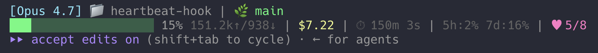

# heartbeat-hook

A tiny [Claude Code](https://docs.claude.com/en/docs/claude-code) `UserPromptSubmit` hook that periodically re-injects your most important rules into the active session so the model doesn't drift halfway through a long conversation.



*The magenta `♥ N/8` at the end of line 2 is the heartbeat counter — it tracks where you are in the cycle. At `8/8` the hook fires and the model gets the reminder.*

## Why

Long sessions cause AI drift. Halfway through a conversation the model "forgets" rules that were front-and-center at the start — short replies, no secrets in chat, no cross-project leakage, no guessing. By the time you notice, an API key has been echoed into the transcript, or a workaround has been merged.

This hook is a heartbeat. Every N prompts it injects a short reminder back into the model's context, pointing it at your `CLAUDE.md` and `MEMORY.md` rules so it re-grounds itself before answering.

## How it works

The hook runs on every `UserPromptSubmit` event, bumps a per-session counter, and emits a reminder to stdout on every Nth prompt (default 8). Claude Code injects that stdout into the conversation as a system reminder before the model responds. The reminder text is ~100 characters — it doesn't re-load `CLAUDE.md` or burn tokens; it just tells the model to consult what's already in context.

Per-session state lives in `~/.claude/state/heartbeat/<session_id>.count`. A timestamped log of every fire is appended to `~/.claude/state/heartbeat/log` — `tail` it any time to verify the hook is alive.

## Install

1. Drop `heartbeat.sh` somewhere persistent (e.g. `~/.claude/hooks/heartbeat.sh`) and make it executable:
   ```sh
   mkdir -p ~/.claude/hooks
   cp heartbeat.sh ~/.claude/hooks/
   chmod +x ~/.claude/hooks/heartbeat.sh
   ```
2. Wire it up in `~/.claude/settings.json`:
   ```json
   {
     "hooks": {
       "UserPromptSubmit": [
         {
           "hooks": [
             {
               "type": "command",
               "command": "bash ~/.claude/hooks/heartbeat.sh"
             }
           ]
         }
       ]
     }
   }
   ```
3. Restart Claude Code.

Requires `jq` on `PATH`. The script prepends `/opt/homebrew/bin` and `/usr/local/bin` so Homebrew installs work in non-interactive hook shells.

## Statusline indicator (optional)

To see the counter live (the magenta `♥ N/8` in the screenshot above), add this to your Claude Code statusline script — the `session_id` is in the JSON it receives on stdin:

```sh
NUDGE_EVERY=8
session_id=$(echo "$input" | jq -r '.session_id // empty')
hb_count=0
[ -n "$session_id" ] && [ -f "$HOME/.claude/state/heartbeat/$session_id.count" ] \
  && hb_count=$(cat "$HOME/.claude/state/heartbeat/$session_id.count")
hb_cycle=0
[ "$hb_count" -gt 0 ] && hb_cycle=$(( ((hb_count - 1) % NUDGE_EVERY) + 1 ))
MAGENTA='\033[35m'; RESET='\033[0m'
heartbeat="${MAGENTA}♥ ${hb_cycle}/${NUDGE_EVERY}${RESET}"
# then append "$heartbeat" to your statusline output
```

## Tuning

Edit the constants at the top of `heartbeat.sh`:

```sh
NUDGE_EVERY=8           # fire reminder every N prompts
```

The reminder text is inline in the script — edit it to match the rules YOU want the model to re-ground on. Mine emphasises: no echoing secrets, no cross-project leakage, no guessing, short replies, re-check `CLAUDE.md` and `MEMORY.md`. Yours will be different.

## State

Per-session counters live in `~/.claude/state/heartbeat/`. Safe to delete any time — sessions start fresh.

## License

MIT.
